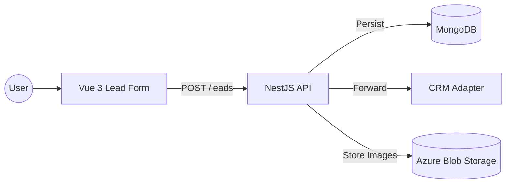
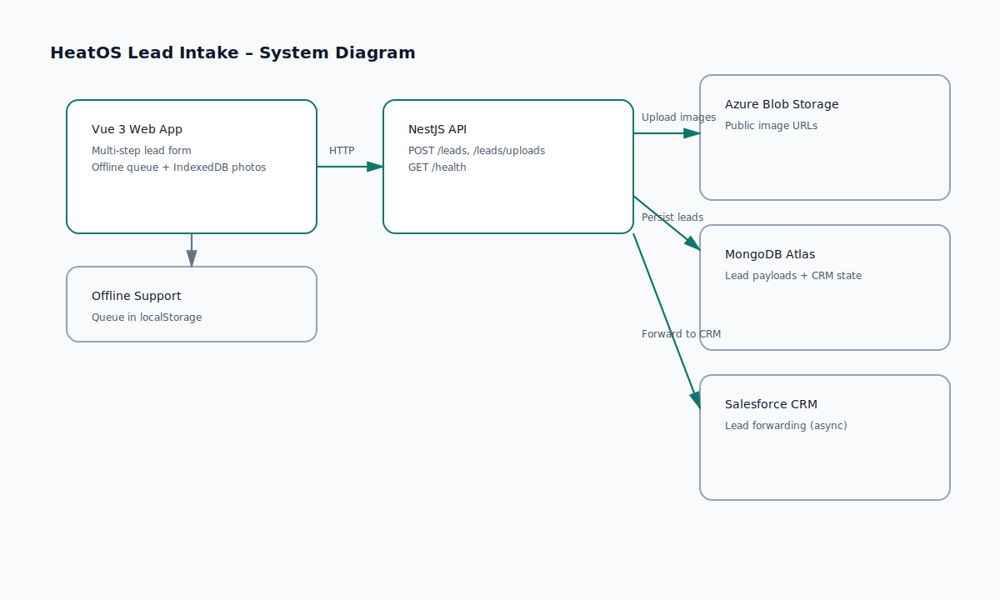

# Architecture Overview

This prototype consists of a Vue 3 client, a NestJS API, and a MongoDB database.
Leads are accepted through a REST API, validated, persisted, and then forwarded
as a downstream side-effect to a CRM adapter. Picture uploads are handled via
Azure Blob Storage.

## Component Diagram (Mermaid)

## System Diagram (SVG)

## Data Flow
1. User submits lead form to the API (multi-step UI).
2. API validates request (server-side authoritative).
3. API persists lead to MongoDB.
4. API forwards lead to CRM adapter with retry/backoff.
5. API returns lead stage + follow-up links.

## Health Checks
- `GET /health` returns MongoDB connectivity and Salesforce auth status.

## Offline Flow (Frontend)
- Leads can be saved offline and auto-sent once connectivity is restored.
- Photos are stored in IndexedDB when offline and uploaded on reconnect.

## Deployment Topology (High Level)
- `web` served as a static SPA.
- `api` served as a container.
- `mongo` as managed service.
